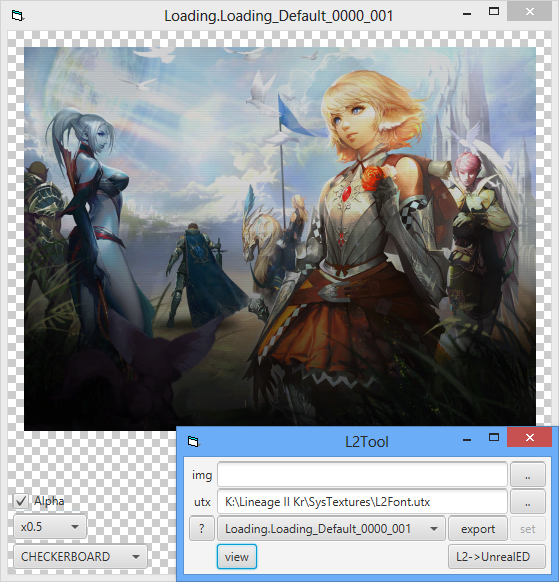

L2Tool
======
Lineage 2 texture viewer/replacer.



Run
---
```bash
# Build the project
./gradlew build

# Run with JavaFX (extracts javafx-17.0.2.zip automatically)
./run.bat
```

Build
-----
```bash
./gradlew build
```

Requirements
------------
Java 17 or later is required.

## Updates by ak4n1
- Updated to Java 17 compatibility
- Updated Gradle wrapper to version 7.6
- Added JavaFX 17.0.2 support with automatic extraction
- Created run.bat script for easy execution