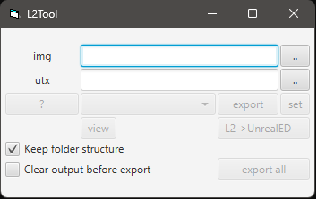

L2Tool
======
Lineage 2 texture viewer/replacer.

<div align="center">
  
</div>

Run
---
```bash
# Build the project
./gradlew build

# Run with JavaFX (extracts javafx-17.0.2.zip automatically)
./run.bat
```

Build
-----
```bash
# Using Gradle directly
./gradlew build

# Using build scripts
# Windows
build-w.bat

# Linux/macOS (requires execute permissions)
chmod +x build-l.sh
./build-l.sh
```

### Build Scripts
- **build-w.bat** (Windows): Build script for Windows that compiles the project and shows build status
- **build-l.sh** (Linux/macOS): Build script for Linux/macOS that compiles the project. Requires execute permissions (`chmod +x build-l.sh`) before running

Requirements
------------
Java 17 or later is required.

## Features
- View textures from Lineage 2 UTX files
- Replace individual textures
- **Export all textures as PNG images** - Batch export all textures from a UTX file to PNG format in the `output` folder
  - **Keep folder structure** checkbox: Maintains the original folder structure from the UTX file (enabled by default)
  - **Clear output before export** checkbox: Clears the `output` folder contents before exporting new textures

## Updates by ak4n1
- Updated to Java 17 compatibility
- Updated Gradle wrapper to version 7.6
- Added JavaFX 17.0.2 support with automatic extraction
- Created run.bat script for easy execution
- Added batch export functionality: Export all textures from UTX files as PNG images to the `output` folder
- Added build scripts: `build-w.bat` for Windows and `build-l.sh` for Linux/macOS
- Added export options:
  - **Keep folder structure**: Maintains original folder structure when exporting
  - **Clear output before export**: Clears output folder before each export